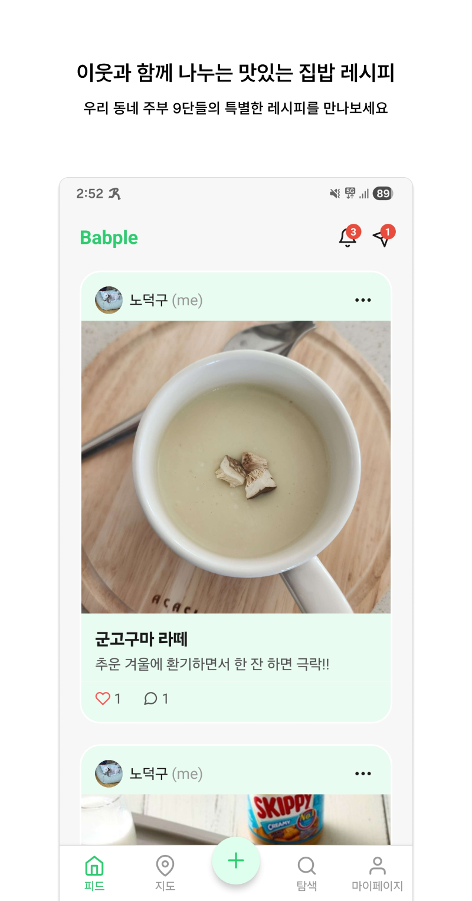
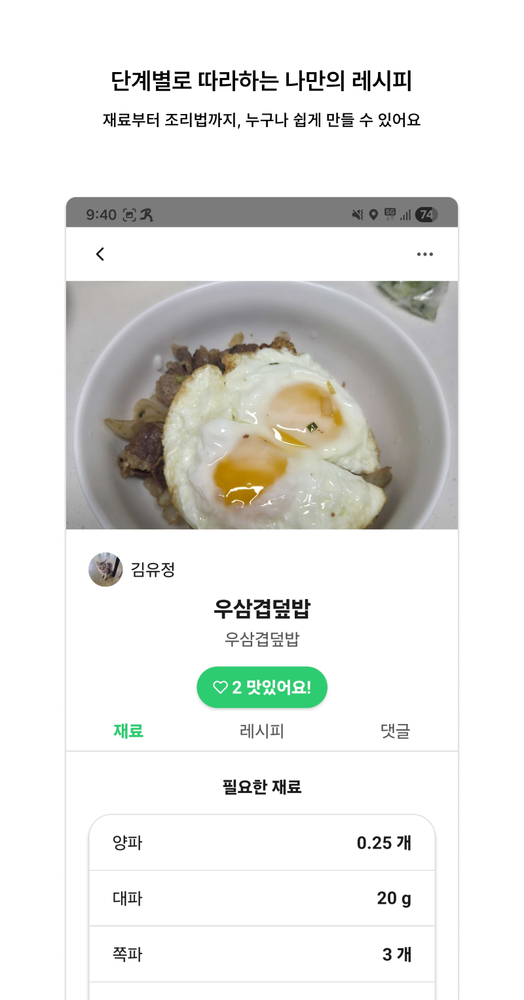
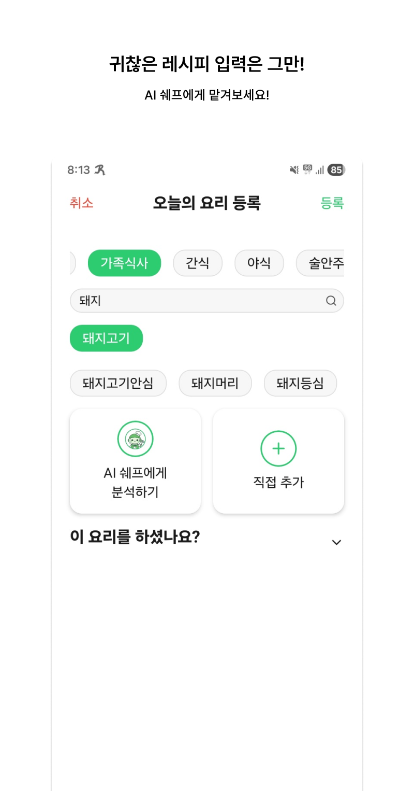
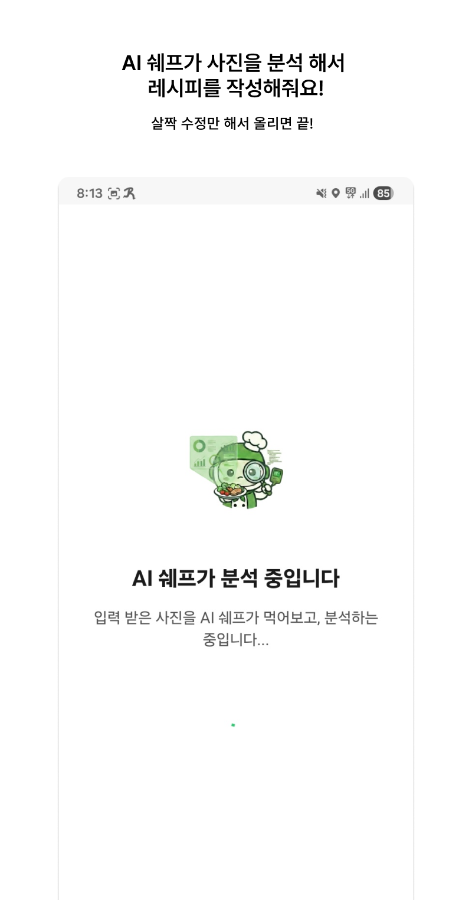
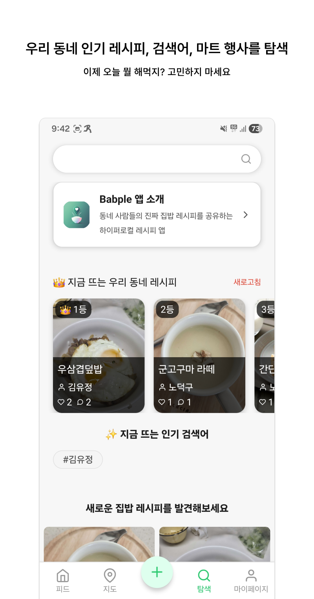
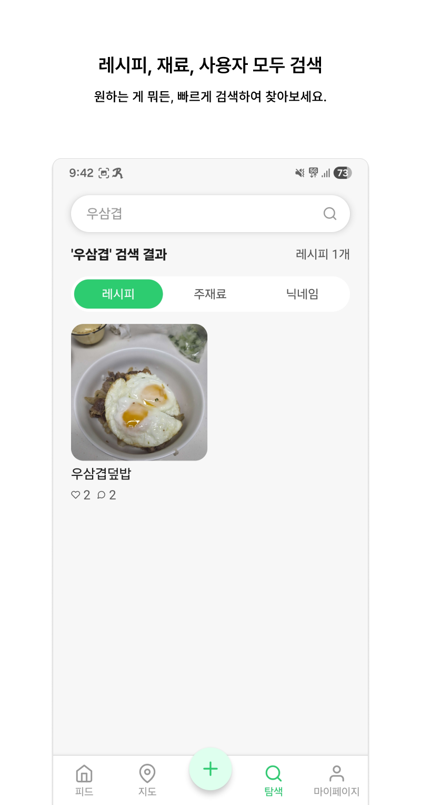
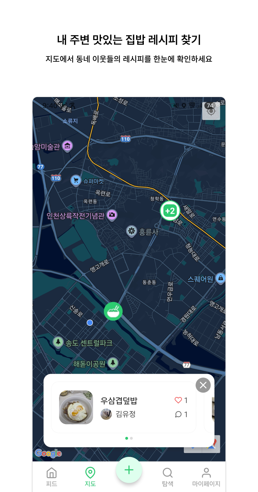
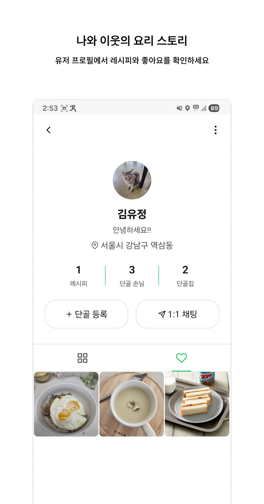

# Babple (밥플) - 회고 문서

> 이 프로젝트는 2025년 10월에 기획을 시작해 12월에 모든 배포 준비를 마쳤지만, 일일 활성 사용자 수 0명에 그친 내 **성공적인 첫 완주작이자, 첫 번째 실패작**이다.
> 
> 과거 내 개인 토이 프로젝트의 완주율은 5% 미만이었다. 회사 프로젝트가 아닌, 내 프로젝트는 늘 기획과 관리의 부재로 중간에 엎어지기 일쑤였다. 
>
> 이 프로젝트는 그 징크스를 끊어내고 1인 애자일 체계와 철저한 문서 기반 개발을 도입해 마침내 릴리즈까지 해낸, 나 스스로 '1인 개발자로 살아남을 수 있겠다'는 확신을 준 프로젝트다.
>
> 완벽한 인프라와 쾌적한 시스템을 구축했지만, 정작 유저에게 "굳이 이 앱을 써야 할 단 하나의 이유"를 설득하지 못했다. 안타깝지만 트래픽 0명인 이 서비스에 더 이상 서버비를 붓고 있을 수는 없다.
>
> 내 손으로 이 프로젝트를 끝내면서, 내 3개월 간의 기획부터 구현, 운영까지의 개발 과정을 기록으로 남기려고 한다.

## 1. 프로젝트 개요
* **프로젝트명**: Babple
* **슬로건**: "오늘, 이웃의 식탁에는 무엇이 올라왔을까?"
* **개발 기간**: 2025년 10월 ~ 2025년 12월 (약 3개월)
* **기획 의도**: 요리 블로그를 시작하려던 아내가 요리 과정을 사진 찍고 글로 정리하는 과정을 너무 귀찮아 하길래... 이를 해결하기 위해 모바일에서 아주 쉽고 간편하게 레시피를 업로드할 수 있는 플랫폼을 구상했다. 단순히 요리를 자랑하는 것을 넘어, 매일 "오늘 저녁 뭐 먹지?"를 고민하는 사람들에게 동네 이웃의 실시간 집밥에서 힌트를 얻고, 언젠가 로컬 상점의 할인 정보까지 연결하는 하이퍼로컬 커뮤니티 생태계를 지향했다.

## 핵심 화면 및 시연

### 간단한 시연 영상

  

 

### 주요 화면

  
  
  

 

  
  
  

 

  
  
  

 

## 2. "코딩은 IDE이 아닌, 책상 위에서 끝낸다."
그동안 내가 해왔던 '주먹구구식' 서브 프로젝트 개발이 아니었다. 상위 설계가 하위 설계를 통제하는 **철저한 문서 기반의 개발**을 적용해 3개월의 마라톤을 완주했다.

1. **초기 기획 및 스코프 확정**: 페르소나를 설정하고 사업 기획서와 요구사항 정의서를 작성했다. 가장 먼저 Screen IDentify를 통해 화면의 개수를 확정하며 데이터가 흐를 물길을 미리 터두었다.
2. **데이터 및 UI 설계**: 논리/물리 ERD를 짜고, Figma로 40여 개의 모바일 와이어프레임을 그렸다. 데이터 구조가 이미 잡혀 있으니 "데이터를 어디서 가져오지?"라는 고민 없이 UX에만 몰두할 수 있었다.
3. **API 명세 및 스토리보드**: 프론트/백엔드 통신 규격을 확립하고 유저 스토리보드를 통해 기획의 논리적 허점을 시뮬레이션했다.
4. **1인 Agile 도입**: 개인 프로젝트의 가장 큰 적은 타협이다. 이를 막기 위해 스스로를 PL이자 개발자로 분리하고 1주 단위 스프린트와 매일 아침 혼자만의 Self-Standup 회의를 Jira에서 진행했다.
5. **구현 및 배포**: Express.js, TypeORM, PostGIS로 백단을 다지고 React Native로 앱을 빚어냈다. 더미 데이터와 Artillery를 이용해 부하 테스트를 마치고 AWS 생태계(S3, EC2, RDS)와 Docker 릴리즈로 심사를 통과했다.

### [스토리보드 핵심 요약]
* 오늘 저녁으로 만든 묵은지 닭갈비가 너무 맛있어 이를 공유하기로 마음먹는다.
* 앱을 열고 음식 카테고리(한식), 종류(볶음), 주재료(닭고기)를 선택한다.
* 선택된 정보에 따라 예상되는 요리 목록이 제공되고, 그중 하나를 골라 본인만의 요리 이름("유정이표 묵은지 닭갈비")을 짓는다.
* 카테고리에 맞는 일반적인 요리 재료들이 상단에 카드로 자동 뜨며, 탭하거나 검색하여 재료 정보를 매우 쉽게 추가한다.
* 레시피 작성 시에도 재료 카드와 조리 행동 카드를 조합하는 방식을 택해, 모바일에서의 번거로운 타이핑을 극단적으로 줄인다.
* 사진과 레시피 등록이 완료되면 동네 지도에 내 핀이 꽂히고, 이웃들은 실시간 핫한 집밥으로 소통한다.

블로그 포스팅의 진입 장벽을 모바일 환경의 '카드 기반 시스템'으로 허물고, 향후 로컬 상점의 광고와 적립금을 도입해 모두가 윈윈하는 생태계를 그리려 했다.

## 3. 화면 및 데이터베이스 설계 자료
모든 구현의 네비게이션이 되어준 설계 산출물들이다.
* **Figma 화면 기획서**: [Figma 보러가기](https://www.figma.com/design/QMf7Ogjv4pr7Vs5XyjhYKA/Babple?m=auto&t=mXjkpvlAupkyerXR-6)
* **DB ERD 구조도**: [dbdiagram 보러가기](https://dbdiagram.io/d/BabPle_ERD-68e725add2b621e422f74a7a)

## 4. 기술 스택 및 주요 구현 전략
* **프론트엔드 - React Native**
* **백엔드 - Express.js & TypeORM**
* **비전 AI 기반 자동 레시피 분석 (AWS Bedrock & Claude 3.5 Sonnet)**: 랜딩 페이지에서 "AI 셰프"로 소개된 핵심 편의 기능. 요리 사진만 올리면 AI가 주재료와 레시피 단계를 추출해 `POST_INGREDIENTS`, `RECIPE_STEPS` 테이블 규격에 맞는 JSON 형식으로 응답하게 프롬프트를 설계했다. 악의적 사용자의 프롬프트 탈취를 막기 위해 시스템 지시어 키워드 백엔드 필터링을 구축했다.

## 5. AWS 배포 및 Docker 아키텍처
* **AWS 기반 셋팅**: API 서버(EC2), 메인 데이터베이스(RDS), 대용량 이미지 스토리지(S3)로 인프라를 분산 설계했다.
* **Docker 컨테이너화**: 지속적인 스케일아웃과 환경 일관성을 위해 백엔드를 Docker 이미지로 빌드해 배포 라인을 자동화했다.
* **무중단 운영 (PM2)**: 단일 스레드 병목으로 다운되는 것을 막기 위해 컨테이너 내부에서도 PM2 클러스터 모드를 적용해 멀티코어를 알뜰하게 활용했다.

## 6. 최적화 및 Artillery 부하 테스트
앱 런칭 전, 트래픽 급증을 가정해 Artillery를 활용한 밀도 높은 부하 테스트를 진행했다. 복잡한 다중 조인 및 공간 인덱싱 연산 구간에서 서버의 한계를 파악하고 시스템을 튜닝했다. 또한 S3 과금 폭탄과 네트워크 지연 방지를 위해, 10MB 크기의 원본 이미지를 다이렉트로 서빙하지 않고 서버 측 리사이징 람다 패턴을 적용, 해상도를 조절해 서빙하는 모듈을 추가했다.

## 7. 앱 스토어 심사 대비 체크리스트
유저 차단, 유해 게시물 신고, 즉각적인 회원 탈퇴 폼 등 개인정보 보호 정책을 설계 단계부터 필수 스펙으로 넣어, 애플과 구글의 앱 마켓 심사를 단 한 번에 통과해냈다.

## 8. 실패 원인 분석
이 모든 시스템을 완벽하게 세팅했다고 생각하고 문을 열었다, 그런데 찾아와주는 손님은 한 명도 없었다. 활성 사용자 "0명"이라는 처참한 성적표를 받은 이유는 기술이 아니라 비즈니스에 있었다고 생각한다.

1. **'가장 중요한 핵심 가치'의 부재**
   아내를 위해 레시피 작성을 간편히 만들겠다는 첫 출발점은 좋았다. 하지만 기획이 진행될수록 상점주 제휴, 광고 연동 같은 거창한 수익 구조 모델에 리소스를 매몰시켰다. 정작 유저 입장에서 "이미 만개의 레시피나 인스타를 잘 쓰고 있는데, 굳이 이 앱을 새로 깔고 적응해야 할 단 하나의 강력한 훅"을 증명해 내지 못했다.
2. **콜드 스타트 방치와 마케팅 한계**
   커뮤니티는 사람이 모여야 굴러간다. 그런데 초기 콘텐츠 생태계를 조성할 마케팅 영업 플랜이 전무했다. 3개월 동안 풀스택 개발과 통합 테스트에 내 모든 체력을 쏟아부은 탓에, 런칭 후 발로 뛰며 초기 레시피를 채워넣을 동력마저 소진해버렸다. 전형적인 "스토어에 올려두면 알아서 오겠지"라는 개발자의 치명적인 오만함이었다.

## 9. 마치며.
* **완벽주의의 독과 애자일의 필요성**: 서버 인프라, 도커라이징, 앱 스토어 통과, 부하 테스트까지 혼자 전 과정을 완벽하게 해낸 것은 내 맷집을 키운 엄청난 성장이었다. 그러나 최소 기능 제품(MVP) 단위로 시장에 던져서 "그래서 타겟 유저가 이걸 진짜 편해 하는가?"를 최소 일주일 단위로 검증했어야 했다.
* **암튼 뭔갈 배움**: TypeORM 환경 설정부터 Docker 빌드, AWS 아키텍처, PostGIS, React Native 배포까지 밤새 에러와 싸운 디버깅 경험은 영구적인 내 자산이 될 것이다.

> *이 프로젝트 코드는 더 이상 운영되지 않는다. 하지만 내게 끝까지 달릴 수 있다는 확신을 준 이 프로젝트의 실패를, 그냥 묻어두지 않고 복기하기 위해 이 글을 남긴다.

마침.*
